<div align="center">

# Periodic Orbit Autoencoder

### Autoencoder Neural Networks for Representations of Periodic Orbit Families

**Thomas H. Clark** · **Daniel J. Scheeres**
<br/>
Colorado Center for Astrodynamics Research, University of Colorado Boulder

[](https://doi.org/10.2514/1.G009889)


<br/>

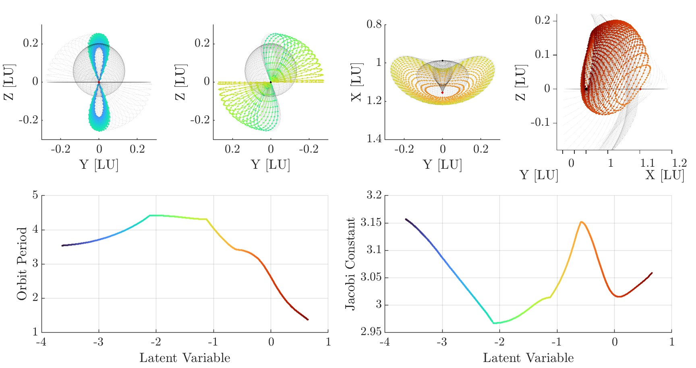

<sub><i>A single decoder network generating the L2 Vertical, Axial, Lyapunov, and Northern Halo families from <b>one</b> scalar latent parameter, which varies monotonically across the bifurcations.</i></sub>

</div>

---

## Overview

Periodic orbit families in the Circular Restricted Three-Body Problem (CR3BP) are usually stored as **discrete** lists of initial conditions. This repository contains the code for our *Journal of Guidance, Control, and Dynamics* paper, which learns a **continuous** representation instead.

An autoencoder compresses a whole periodic orbit (51 states equally spaced in time, plus the period) into a **single latent scalar `c`**. The trained decoder then acts as a differentiable, continuous map

$$
D(c) = \big[\,\psi(c,\theta_0),\ \psi(c,\theta_1),\ \dots,\ \psi(c,\theta_{50}),\ T\,\big], \qquad \theta_i = \tfrac{2\pi i}{51},
$$

that returns a ready-to-correct multiple-shooting initial guess for **any** member of the family.

<table>
<tr>
<td width="33%" valign="top">

**🛰️ Continuous database**<br/>
One scalar picks out a unique orbit anywhere in the family. The latent is monotonic along the family, which the period and Jacobi constant are not.

</td>
<td width="33%" valign="top">

**✅ Fully correctable**<br/>
Every decoded test orbit converges to a true CR3BP periodic orbit with variable-period multiple shooting. The median is 3–4 Newton iterations.

</td>
<td width="33%" valign="top">

**🔀 Across bifurcations**<br/>
One network spans four connected families (Halo → Lyapunov → Axial → Vertical) along a path in the Earth–Moon bifurcation diagram.

</td>
</tr>
</table>

---

## Contents

- [How it works](#how-it-works)
- [Results](#results)
- [Repository structure](#repository-structure)
- [File reference](#file-reference)
- [Getting started](#getting-started)
- [Data format](#data-format)
- [Citation](#citation)

---

## How it works

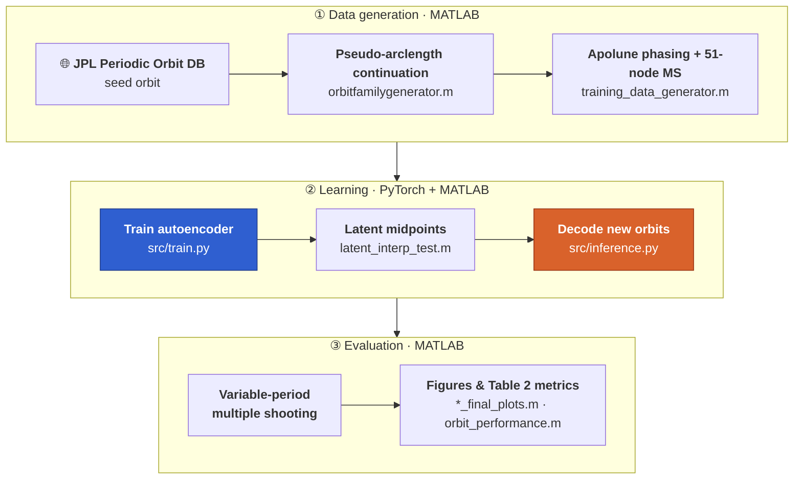

1. **Generate families (MATLAB).** A seed orbit is continued with pseudo-arclength continuation (`Δs` step). Continuation stops at a bifurcation, at lunar impact, or when it fails to converge.
2. **Build training vectors.** Each orbit is phased so node 0 sits at apolune (`y₀ = 0`, `ẋ₀ = 0`), sampled at 51 points equally spaced in time, and corrected with multiple shooting. `x` is re-centered on its Lagrange point, and the result is flattened with the period `T` into a 307-vector.
3. **Train (PyTorch).** A symmetric, fully connected autoencoder with a 1-D bottleneck is trained with Adam on `MSE(states) + λ_T · MSE(T)`, using a step learning-rate decay.
4. **Test by interpolation.** Training orbits are encoded to `cⱼ`. The midpoints `(cⱼ + cⱼ₊₁)/2` are decoded, so every test orbit lies *between* training samples, and each decoded orbit is then corrected with variable-period multiple shooting.

<p align="center">
  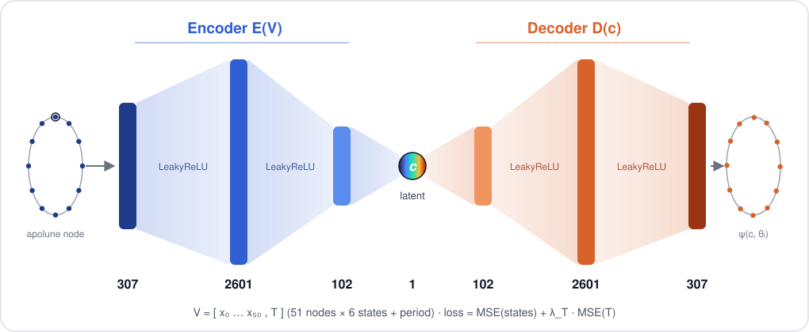
</p>

| Hyperparameter | Value |
|---|---|
| Input / output dimension | 307 (51 nodes × 6 states + period) |
| Encoder | 307 → 2601 → 102 → **1** (LeakyReLU) |
| Decoder | **1** → 102 → 2601 → 307 (LeakyReLU) |
| Optimizer | Adam, lr = 1e-4 – 3e-4, `StepLR` (step 400, γ = 0.1) |
| Epochs / batch size | 1000 / 20 |
| Train / validation split | 0.95 / 0.05 (per config) |
| Period loss weight `λ_T` | 2/306 ≈ 6.54 × 10⁻³ |

---

## Results

### L2 Halo family: the hardest case

The network is trained on 6052 Northern and Southern L2 Halo orbits (`Δs = 5√2 × 10⁻⁴`), from the Lyapunov bifurcation down to the NRHO that grazes the lunar surface. It is tested on the latent midpoints between them.

<table>
<tr>
<td width="50%" align="center">
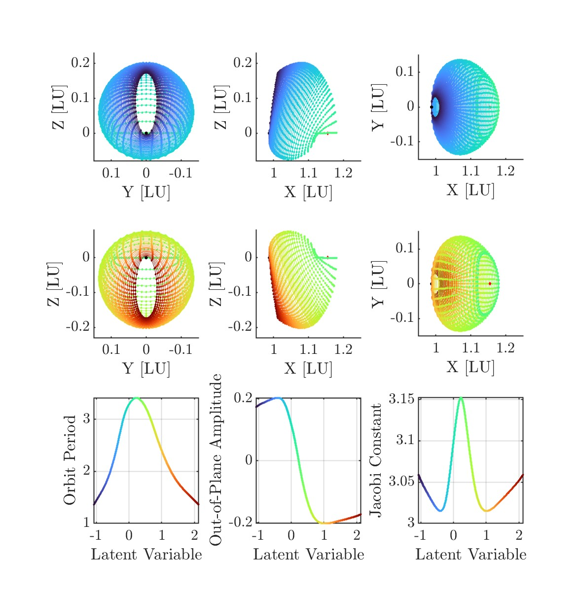
<br/><sub><b>Decoded L2 Halo family.</b> Dots are raw decoder output and lines are the corrected orbits. The bottom row shows how period, out-of-plane amplitude, and Jacobi constant vary with the single latent variable.</sub>
</td>
<td width="50%" valign="top">
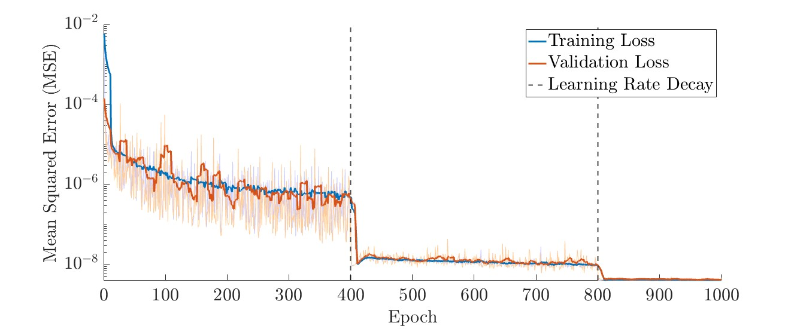
<br/><sub><b>Training and validation loss.</b> Loss falls about six orders of magnitude. The two learning-rate decays at epochs 400 and 800 are visible.</sub>
<br/><br/>
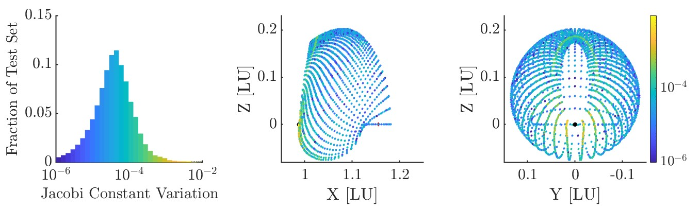
<br/><sub><b>Jacobi constant variation</b> along the raw decoded orbits. Nothing in training enforces it, yet it stays near-constant, with the largest deviations near perilune.</sub>
<br/><br/>
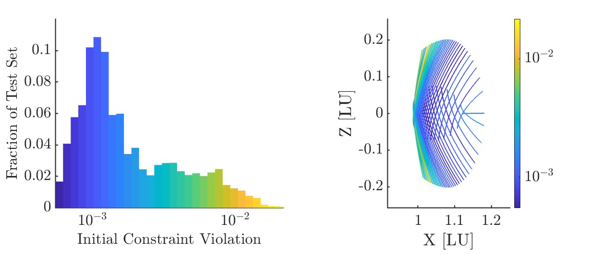
<br/><sub><b>Initial constraint violation</b> ‖F(V)‖ of each decoded orbit, typically about 10⁻³. The largest violations occur near the NRHOs.</sub>
</td>
</tr>
</table>

### Other families

<table>
<tr>
<td width="50%" align="center">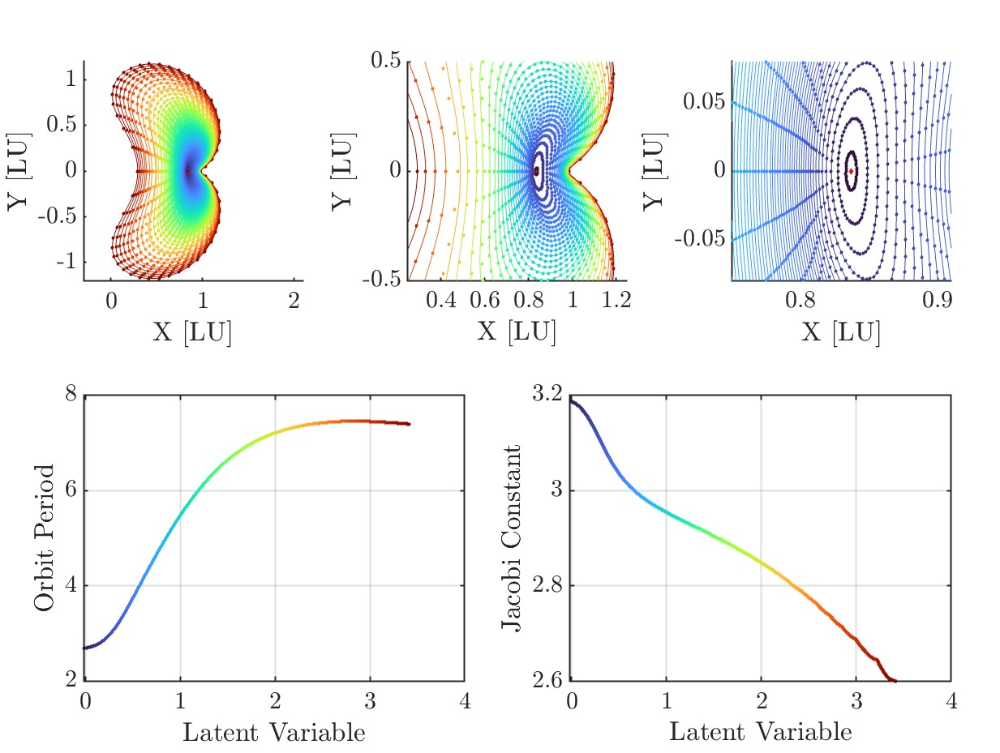<br/><sub><b>L1 Lyapunov</b> (5855 training orbits)</sub></td>
<td width="50%" align="center">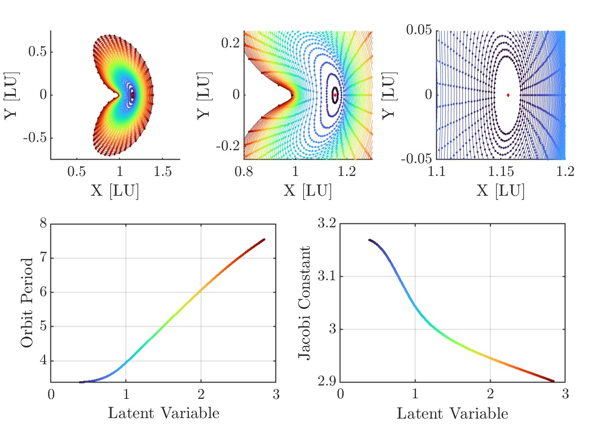<br/><sub><b>L2 Lyapunov</b> (4330 training orbits)</sub></td>
</tr>
<tr>
<td width="50%" align="center">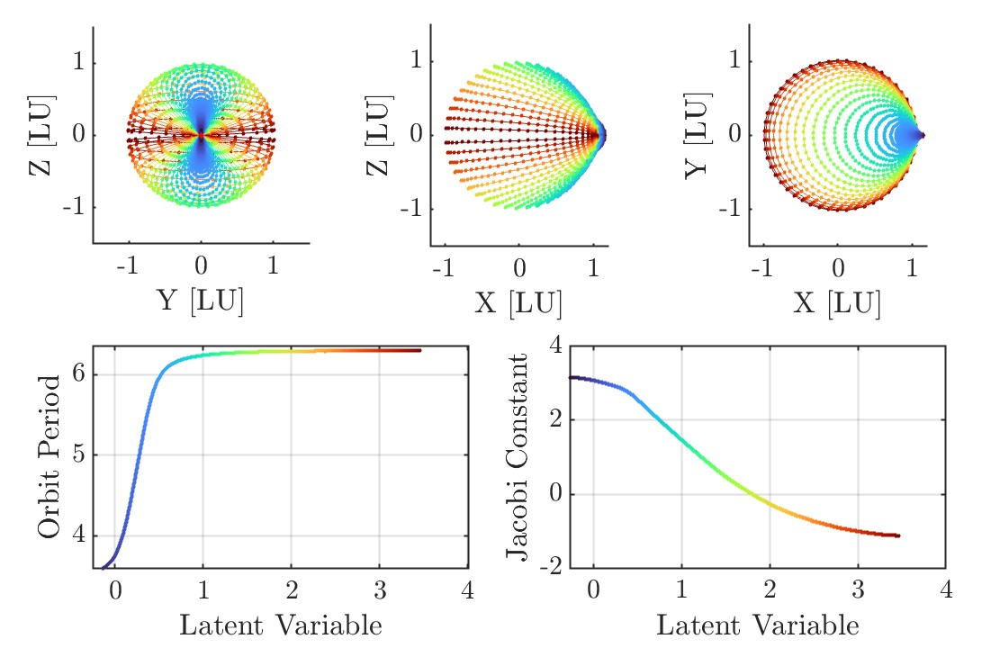<br/><sub><b>L2 Vertical</b> (7012 training orbits)</sub></td>
<td width="50%" align="center">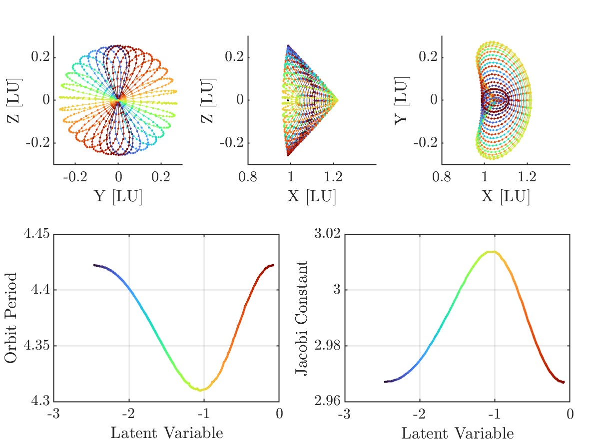<br/><sub><b>L2 Axial</b> (1550 training orbits)</sub></td>
</tr>
</table>

### Performance summary

Median values over the test set, averaged over five independent trainings (Table 2 of the paper):

| Orbit family | C<sub>initial</sub> | C<sub>final</sub> | ΔC | ‖F(V)‖ | Steps | ΔT | ΔV |
|---|:---:|:---:|:---:|:---:|:---:|:---:|:---:|
| L1 Lyapunov | 3.1875 | 2.5854 | 4.6e-5 | 1.6e-3 | 3 | 1.4e-3 | 3.6e-4 |
| L2 Lyapunov | 3.1698 | 2.9015 | 2.9e-5 | 1.6e-3 | 3.6 | 3.2e-3 | 4.0e-4 |
| L2 Halo | 3.1521 | 3.0590 | 3.9e-5 | 1.5e-3 | 4 | 8.5e-4 | 2.4e-4 |
| L2 Vertical | 3.1499 | −1.1266 | 6.1e-5 | 1.4e-3 | 3 | 4.9e-4 | 4.8e-4 |
| L2 Axial | 2.9667 | 2.9667 | 6.3e-5 | 2.5e-3 | 4 | 2.1e-4 | 4.8e-4 |
| **Multiple-family** | 3.1499 | 3.0588 | 4.0e-5 | 1.4e-3 | 3 | 5.6e-4 | 2.1e-4 |

<sub>ΔC: Jacobi constant deviation along the decoded orbit · ‖F(V)‖: initial multiple-shooting constraint violation · Steps: Newton iterations to reach 10⁻¹⁰ · ΔT / ΔV: correction applied to the period / free-variable vector. All values are nondimensional.</sub>

### Invertibility (Appendix)

Encoding and then decoding 4280 *unseen* Halo orbits (`Δs = 10⁻³`, a step size with no common multiple with the training set) and correcting the result changes the period by a median of **8.6 × 10⁻⁴**, so the encoder–decoder pair is close to invertible.

<p align="center">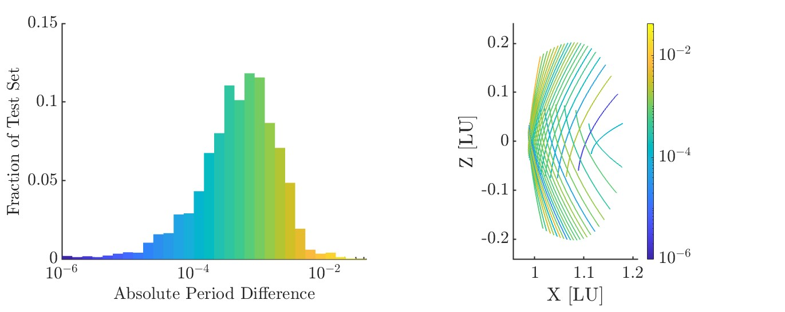</p>

<details>
<summary><b>Supplementary: network size vs. accuracy</b></summary>
<br/>
<p align="center">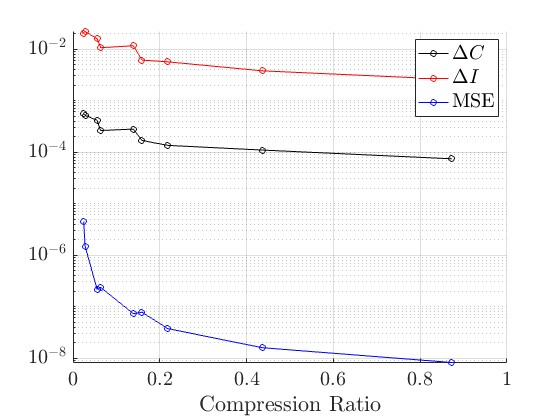</p>

Accuracy of Halo-family models of decreasing size, plotted against compression ratio (network parameters ÷ numbers in the 4280-orbit test set). Smaller networks raise both the reconstruction MSE and the Jacobi-constant deviation. See [`HaloFamilyMiniTest/`](HaloFamilyMiniTest/).
</details>

---

## Repository structure

```text
.
├── src/                              # Core library
│   ├── train.py                      #   Train the autoencoder from a YAML config
│   ├── train_mini.py                 #   Train the reduced-width network (compression study)
│   ├── train_split.py                #   Train the split state/period network
│   ├── inference.py                  #   Decode a list of latent values into orbits
│   ├── models/
│   │   ├── autoencoder.py            #   Main model: 307 → 2601 → 102 → 1
│   │   ├── autoencoder_mini.py       #   Reduced model: 307 → 255 → 51 → 1
│   │   └── autoencoder_split.py      #   Separate state and period encoder branches
│   ├── utils/                        #   CR3BP dynamics, correctors, continuation (MATLAB + Python)
│   └── plotting/loss_plot.m          #   Training/validation loss figure
│
├── data/                             # Datasets (large files not tracked, see "Data format")
│   ├── cr3bp_constants.mat           #   μ, Lagrange points, body radii
│   ├── raw/                          #   Family initial conditions [x0 … ż0, T]
│   │   └── orbitfamilygenerator.m    #   Pseudo-arclength continuation of each family
│   └── processed/                    #   307 × N_orbits training matrices
│       └── training_data_generator.m #   Raw ICs → apolune-phased 51-node MS vectors
│
├── HaloFamily/                       # § IV.A  L2 Halo family (N + S branches)
├── L1Lyapunov/                       # § IV.B  L1 Lyapunov family
├── L2Lyapunov/                       # § IV.B  L2 Lyapunov family
├── L2Vertical/                       # § IV.B  L2 Vertical family
├── L2Axial/                          # § IV.B  L2 Axial family
├── Halo2VerticalDoedel/              # § IV.C  Multiple-family model along the bifurcation path
│
├── HaloFamilyMiniTest/               # Supplementary: reduced-width network / compression study
├── HaloFamilySubsetTest/             # Supplementary: Northern Halo family with a gap removed
├── HaloFamilyPlanarSupplement/       # Exploratory: Halo data + fine sampling near planar bifurcation
├── HaloFamilySplitPlanarSupplement/  # Exploratory: split state/period architecture
│
├── latent_interp_test.m              # Build midpoint latent test set from encoded training orbits
├── orbit_performance.m               # Compute Table 2 metrics for a trained model
└── requirements.txt
```

---

## File reference

### `src/`: Python training and inference

| File | Description |
|---|---|
| [`train.py`](src/train.py) | Loads a config and the training matrix, makes a seeded train/validation split, and trains `Autoencoder` with Adam, `StepLR`, and the loss `MSE(states) + λ_T·MSE(T)`. It prints per-epoch losses and then decodes the test set. As committed, it writes only `decoded_data_path_runs`, the output used for the five-run statistics. The lines that save the model, latents, and loss history are commented out at the end of `main()`. |
| [`train_mini.py`](src/train_mini.py) | Same loop with `models/autoencoder_mini.py`. Saves the decoded test set, latents, and `state_dict`. |
| [`train_split.py`](src/train_split.py) | Same loop with `AutoencoderSplit` (hard-coded `λ_T = 5/306`). |
| [`inference.py`](src/inference.py) | Loads `model_path`, reads a column of latent values from `latent_data_fixed_latent`, runs **only the decoder**, and writes `decoded_data_fixed_latent_path`. |
| [`models/autoencoder.py`](src/models/autoencoder.py) | The paper's model: a symmetric MLP with a 1-D bottleneck. It exposes `encode()` and `decode()`. |
| [`models/autoencoder_mini.py`](src/models/autoencoder_mini.py) | Narrower variant (≈184k parameters vs. ≈2.1M). |
| [`models/autoencoder_split.py`](src/models/autoencoder_split.py) | Encodes the 306 states and the period in separate branches, joins them into one latent, and decodes through separate heads. |

### `src/utils/`: CR3BP toolkit

| File | Description |
|---|---|
| [`cr3bp.m`](src/utils/cr3bp.m) / [`cr3bpStateOnly.m`](src/utils/cr3bpStateOnly.m) | Equations of motion, with and without the 36 STM variational equations. |
| [`gradU.m`](src/utils/gradU.m), [`uJacobian.m`](src/utils/uJacobian.m), [`stmJacobian.m`](src/utils/stmJacobian.m) | Pseudo-potential gradient, its Hessian, and the full 6 × 6 dynamics Jacobian `A(t)`. |
| [`jacobiConstant.m`](src/utils/jacobiConstant.m) | Jacobi constant `C = 2U − v²` (vectorized over rows). |
| [`lagrangePts.m`](src/utils/lagrangePts.m) | Positions of L1–L5. |
| [`differentialCorrectionMCF.m`](src/utils/differentialCorrectionMCF.m) | Single-shooting corrector with selectable symmetry constraints. Returns the Jacobian used for the continuation null space. |
| [`pseudoArcLengthContinuation.m`](src/utils/pseudoArcLengthContinuation.m) | Pseudo-arclength continuation of a family. It stops at lunar or Earth impact, or when the stability index indicates a bifurcation. |
| [`singleShooting.m`](src/utils/singleShooting.m) | Fixed-period single shooting that locks apolune (`y₀ = ẋ₀ = 0`) and flags lunar collisions. |
| [`multipleShooting.m`](src/utils/multipleShooting.m) | Fixed-period multiple shooting with 51 nodes (Eq. 14). |
| [`multipleShootingVariablePeriod.m`](src/utils/multipleShootingVariablePeriod.m) | Variable-period multiple shooting (Eqs. 11–13). This is the corrector used to evaluate decoded orbits. It returns iterations, the initial constraint violation, and the corrected period. |
| [`cr3bp.py`](src/utils/cr3bp.py) | Python ports of the dynamics, Jacobi constant, Lagrange points, and single/multiple shooting (requires SciPy). |
| [`readyaml.m`](src/utils/readyaml.m) | YAML reader for MATLAB, so MATLAB and Python share one config. Third-party code by M. J. Jongeneel. |

### Experiment folders

Each experiment folder holds a **config**, **MATLAB analysis scripts**, and, locally, the trained `.pth`, decoded, and latent `.txt` files and a `Plots/` directory.

| Folder | Paper | Config | What it contains |
|---|---|---|---|
| [`HaloFamily/`](HaloFamily/) | Figs. 3–6, A1 | `halo_config.yaml` | Baseline L2 Halo model. Includes the performance deep-dive and the invertibility appendix. |
| [`L1Lyapunov/`](L1Lyapunov/) | Fig. 7 | `lyap_config.yaml` | L1 Lyapunov model. |
| [`L2Lyapunov/`](L2Lyapunov/) | Fig. 8 | `config.yaml` | L2 Lyapunov model. |
| [`L2Vertical/`](L2Vertical/) | Fig. 9 | `config.yaml` | L2 Vertical model. |
| [`L2Axial/`](L2Axial/) | Fig. 10 | `config.yaml` | L2 Axial model. |
| [`Halo2VerticalDoedel/`](Halo2VerticalDoedel/) | Fig. 12 | `config.yaml` | Multiple-family model: N. Halo → Lyapunov → Axial → Vertical (6537 training orbits). |
| [`HaloFamilyMiniTest/`](HaloFamilyMiniTest/) | Supplementary | `halo_config.yaml` | Reduced-width network. `compressionplot.m` makes the accuracy-vs-compression figure. |
| [`HaloFamilySubsetTest/`](HaloFamilySubsetTest/) | Supplementary | `halo_subset_config.yaml` | Northern Halo family with a contiguous block of orbits removed from training, to probe interpolation across a gap. |
| [`HaloFamilyPlanarSupplement/`](HaloFamilyPlanarSupplement/) | Exploratory | `halo_config.yaml` | Halo training data (`Δs = 5 × 10⁻⁴`) supplemented with a finer `Δs = 10⁻⁴` segment near the planar Lyapunov bifurcation, plus a `zoffset` variant. |
| [`HaloFamilySplitPlanarSupplement/`](HaloFamilySplitPlanarSupplement/) | Exploratory | `halo_config.yaml` | Same data with the split state/period architecture. |

Scripts inside the experiment folders follow a common pattern:

| Script | Purpose |
|---|---|
| `*decoder_test.m` | Exploratory analysis of the test set decoded at train time (`decoded_data_path`). It corrects every orbit and plots family views, latent relationships, Jacobi deviations, constraint violations, step sizes, and period corrections. |
| `*decoder_test_final_plots.m` | **Publication figures.** Decodes the midpoint latents (`decoded_data_fixed_latent_path`), corrects them with variable-period multiple shooting, and produces the family, Jacobi, constraint-violation, and invertibility figures along with the summary statistics quoted in the text. |

### Top-level scripts

| File | Description |
|---|---|
| [`latent_interp_test.m`](latent_interp_test.m) | Reads the encoded training latents, computes the midpoints `(cⱼ + cⱼ₊₁)/2`, and writes `latent_test_fixed_latent.txt` for `inference.py`. |
| [`orbit_performance.m`](orbit_performance.m) | Corrects the orbits in `decoded_data_path_runs` in parallel and prints the median ΔC, ‖F(V)‖, steps, ΔT, and ΔV (Table 2). Set `xShift` and `config` at the top to switch families. |

---

## Getting started

### Requirements

- **Python** ≥ 3.10 with `numpy`, `torch`, `matplotlib`, and `PyYAML` (plus `scipy` for `src/utils/cr3bp.py`)
- **MATLAB** with the Parallel Computing Toolbox (the scripts use `parpool('threads', …)`)

```bash
pip install -r requirements.txt
```

> [!NOTE]
> All scripts use paths relative to the **repository root**, so run them from there, in both Python and MATLAB. The configs set `device: mps` (Apple Silicon). Change this to `cuda` or `cpu` for other hardware.

### 1. Generate orbit families *(MATLAB)*

```matlab
% Continue each family from a JPL seed orbit → data/raw/*.txt  ([x0 y0 z0 ẋ0 ẏ0 ż0 T] per row)
run data/raw/orbitfamilygenerator.m

% Phase at apolune, sample 51 nodes in time, MS-correct, recenter on L-point → data/processed/*.txt
% (edit xShift, the input file, and file_ext in the "MUST FIX" block first)
run data/processed/training_data_generator.m
```

### 2. Train *(Python)*

```bash
python src/train.py --config HaloFamily/halo_config.yaml
```

### 3. Build the interpolated test set and decode it

```matlab
run latent_interp_test.m   % writes <experiment>/latent_test_fixed_latent.txt
```

```bash
python src/inference.py --config HaloFamily/halo_config.yaml
```

### 4. Correct and evaluate *(MATLAB)*

```matlab
run HaloFamily/halo_decoder_test_final_plots.m   % figures + statistics
run orbit_performance.m                          % Table 2 metrics
```

### Config keys

| Key | Meaning |
|---|---|
| `train_data_path` / `test_data_path` | Training matrix and held-out matrix (a different continuation step `Δs`) |
| `model_path` | Where the `state_dict` is saved or loaded |
| `decoded_data_path`, `latent_data_path` | Decoded and encoded test set written at train time |
| `latent_train_data_path` | Encoded latents of the training orbits |
| `decoded_data_path_runs` | Decoded test set for the repeated-training statistics |
| `latent_data_fixed_latent`, `decoded_data_fixed_latent_path` | Input latents and output orbits for `inference.py` |
| `train_frac`, `random_seed` | Train/validation split and its seed |
| `batch_size`, `learning_rate`, `num_epochs` | Optimizer settings |
| `lr_scheduler_step_size`, `lr_schedule_gamma` | `StepLR` schedule |
| `lambda_T` | Weight on the period reconstruction loss |
| `device` | `mps`, `cuda`, or `cpu` |

---

## Data format

Every processed dataset is a comma-separated **307 × N<sub>orbits</sub>** matrix with **one orbit per column**:

```text
row   1–6   : x₀  y₀  z₀  ẋ₀  ẏ₀  ż₀     ← node 0, at apolune (y = ẋ = 0)
row   7–12  : x₁  y₁  z₁  ẋ₁  ẏ₁  ż₁     ← node 1, Δt = T/51 later
  ⋮
row 301–306 : x₅₀ … ż₅₀
row     307 : T                           ← orbit period
```

All quantities are nondimensional Earth–Moon CR3BP units (μ = 0.01215058560962404). The `x` coordinate is **shifted by the family's Lagrange point** (`x − x_L1` or `x − x_L2`), and analysis scripts add `xShift` back before correcting.

**File naming.** The suffix gives the continuation step: `1em3` → 10⁻³, `sqrt2em3` → √2 × 10⁻³, `5sqrt2em4` → 5√2 × 10⁻⁴, `2em3` → 2 × 10⁻³. Training and test sets use step sizes with an irrational ratio, so the two sets never share an orbit.

> [!IMPORTANT]
> The orbit datasets (`data/**/*.txt`), trained weights (`*.pth`), and model outputs (`*.txt`) are excluded by `.gitignore` because of their size (hundreds of MB of data and ≈ 8.5 MB per model). The generator scripts in `data/raw/` and `data/processed/` rebuild the datasets from scratch.

---

## Citation

If you use this code, please cite:

```bibtex
@article{clark2026autoencoder,
  title   = {Autoencoder Neural Networks for Representations of Periodic Orbit Families},
  author  = {Clark, Thomas H. and Scheeres, Daniel J.},
  journal = {Journal of Guidance, Control, and Dynamics},
  year    = {2026},
  doi     = {10.2514/1.G009889},
  note    = {Article in Advance}
}
```

An earlier version was presented as Paper 25-862 at the 2025 AAS/AIAA Astrodynamics Specialist Conference, Boston, MA.

## Acknowledgments

This work was supported by a NASA Space Technology Graduate Research Opportunity (NSTGRO). D. J. Scheeres acknowledges support from AFOSR grant FA9550-25-1-0016. Seed orbits come from the [JPL Three-Body Periodic Orbits Database](https://ssd-api.jpl.nasa.gov/periodic_orbits.api).

<div align="center">
<sub>Questions? Open an issue or contact <a href="mailto:tommy.clark@colorado.edu">tommy.clark@colorado.edu</a>.</sub>
</div>
